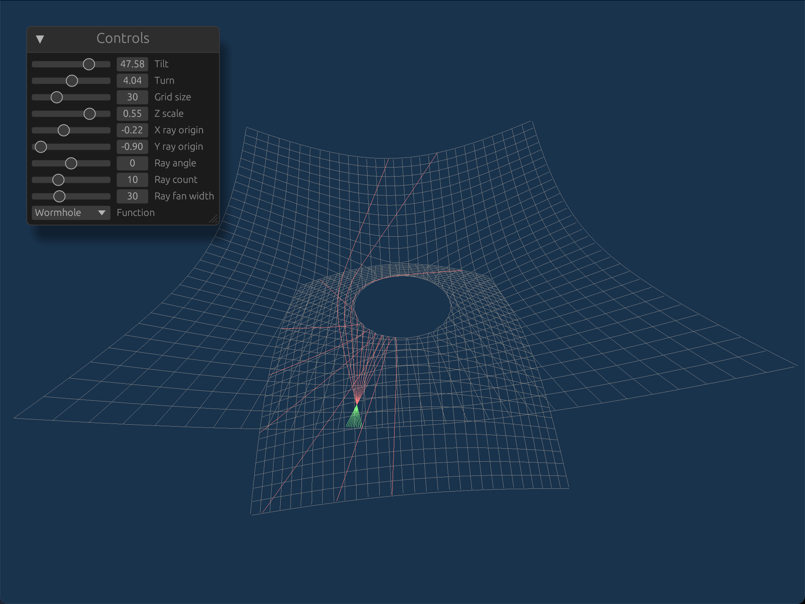

# Simple Curved Space visualiser



I'll come clean. My end goal is to visualise what a wormhole would
actually look like. Not a physically accurate one, but at least a
mathematically accurate one - what you'd get if you cut out a subspace
in a pair of $\mathbb{R}^3$ spaces and connected them with a
"tube". I'm nowhere near that, right now.

As a predecessor step, I'd like to do that for a pair of
$\mathbb{R}^2$ spaces. Stepping back further, I'd like to understand
how curved space behaves, mathematically, full stop. On that bit, I
feel I'm making progress.

More on that later. First, what is this, and how do you run it?

## What is this?

This program renders a curved 2D space (embedded in 3D, with a choice
of 2D surfaces), and lets you point a line through it, seeing how the
line curves over the space. There are various controls you can use,
I'm lazy (well, actually extremely low on energy) and I'll let you
figure them out by yourself, reading the source if necessary.

## Building and running

### Native

To run with glutin and winit:

```shell
cargo run --features=glutin_winit
```

To run with sdl2:

```shell
cargo run --features=sdl2
```

Running with sdl2 is not recommended, as the egui-based GUI is
disabled, effectively rendering it useless. This is really a stub for
future work.

### Web

To run with web-sys:

```shell
cargo build --target wasm32-unknown-unknown
mkdir -p generated
wasm-bindgen target/wasm32-unknown-unknown/debug/curved-space.wasm --out-dir generated --target web
cp index.html generated
```

`web.sh` has been provided to do this, for convenience. You may need
to do `cargo install wasm-bindgen-cli` first, if you haven't done wasm
work before.

CORS prevents you opening this as a file in a web browser, but you can
start a small local web browser, e.g. `python3 -m http.server 8080` in
the `generated` directory.

## The maths

There's a lot of maths behind differential geometry that I've never
really mastered. I have a copy of Darling's *Differential Forms and
Connections*, and the bits of it I've read are very good (and
differential forms are a pleasant generalisation of the 3D div, curl
and grad, and seem to have a lot in common with geometric algebra),
but I've not made it all the way through.

I felt that when it comes to understanding curved spaces, maybe I
should take a practical "work it out for yourself" approach.

I also still don't understand how General Relativity (GR) is supposed
to work, and understand the maths to be hard. Maybe I can try to
understand the behaviour of geodesics in curved space independent of
the physics?

So, here I am. The clever way of understanding curved space is as an
entity in itself. The dumb way is as a subspace of a higher-dimension
Euclidean space. IIUC they encompass the same spaces, but the former
is a much more elegant representation. I'm using the latter, hopefully
as a stepping stone to deeper understanding, as it's certainly the
most intuitive way to start.

### Round 0

Starting off, I ended up putting a lot of effort into just getting
anything to display in OpenGL, working on both web and native, with an
egui interface. The maths was very much secondary!

As such the kind of space we show is simply a uni-valued function in
the Z direction of values in the X and Y directions. As I go along,
I've been having ideas about how to generalise this to... more general
spaces. I have ideas, but I'm not clear yet. Do I want to use an atlas
of flattish pieces, or maybe an implicit surface?

Then, there's my approach for tracing a "geodesic" on the
surface. Scare quotes because I'm making this up as I go along, and
have no real mathematical basis so far.

The current approach is to trace the curve step by step by
extrapolating the line between the last two points to get an
approximate point in 3-space, likely off the 2-space surface (unless
it's locally perfectly flat), and then projecting that point down to
the nearest point on the 2-space surface (using the Euclidean 3-space
metric).

Why does this feel like it should work? Well, any three non-linear
points define a plane. By projecting that point from the linear
extrapolation down to the nearest point in the surface, I think we're
finding the plane that intersects the surface in the curve of least
curvature (i.e. closest to being a line).

Why do we want the least curved path? A straight line is the shortest
path between two points. I feel this is massively handwavey and
informal, yet enough to feel like something's about right here.

Qualitatively, it works, too! Positive curvature bends lines one way,
negative curvature the other. Hurrah.

### Checkpoint

Yet I've not got any real mathematical basis for this. It's just an
approach that feels right to me. Why am I even pushing this code in
this state? Well, my health is making me ultra-low-energy at this
point. I don't know how much progress I'll make in how long, so I want
to checkpoint my progress, such as it is. So, here we are.

### Round 1

Proposed plan:

 * We know that geodesics are the shortest paths on the surface, so
   write some code that perturbs points and check that the curve grows
   longer.
 * Write up and explore the integral for length of a curved line on a
   curved 2D surface embedded in 3D, maybe briefly think about how
   this generalises to higher dimensions.
 * Review Feynman's explanation of calculus of variations, and how
   that goes from a global integral optimisation to a step-by-step
   optimisation of tracing a ray. Use this to get a formalised local
   constraint on the curves we draw.
 * See if I can use that to make a better tracer and/or understand
   whether my current approach does the right thing.

### And beyond

End goals are:

  * To be able to trace rays through a "wormhole" surface that can
    then be generalised into a curved space raytracer in 3D.
  * To understand how to describe the curvature of space at a
    particular point, independent of an embedding space. I think I'm
    trying to reinvent the curvature tensor used in GR.

## Design choices on the coding side

I wanted to build something that could target web and native. It
didn't need to be particularly lightweight - on the web side, I just
wanted it to be accessible on the web, not neatly and lightly fitting
into some other web page. I wanted to use Rust as it's my favourite
programming language.

I wanted to use some form of modern OpenGL. I have experience of
old-school OpenGL, wanted the opportunity to learn the modern
pipeline, and felt it had a nice balance between being portable and
not requiring me to do wheel reinvention, as might be required for
more low-level graphics libraries.

Quite frankly, it probably makes more sense to do this kind of thing
in some kind of scripting language or even computational maths
environment. It would certainly allow me to cut to the chase. I just
like building things from the bottom up and having a lot of control. I
like to build production infra, and tend to work like that even for
projects that are entirely different.

When it comes to GL libraries, I chose
[glow](https://crates.io/crates/glow) as it seems to be simple,
popular, cross-platform (including wasm) and maintained.

For GUI control elements, I chose
[egui](https://crates.io/crates/egui), a nice immediate-mode
system. Previously I'd used it as the GUI framework for some tools
I've built, this time I'm using it as a library (i.e. it's no longer
"in control") to drive the UI elements.

Other than that, there are some pretty standard libraries, AFAICT.

There is something of a conspicuous lack of tests. It's not that the
code is untestable, it's more that it's more hassle than I want for a
simple hobby project like this. It's a bunch of UI code wrapping some
numerical code. Testing GUIs is a well-known pain. Testing numerical
code, in my experience, is usually very regression-testing-like:
checking that if you put these numbers in, you get these numbers
out. The problem is, as I toy around with that, trying to learn, I
don't really know what the right numbers are! So, no tests right now.
